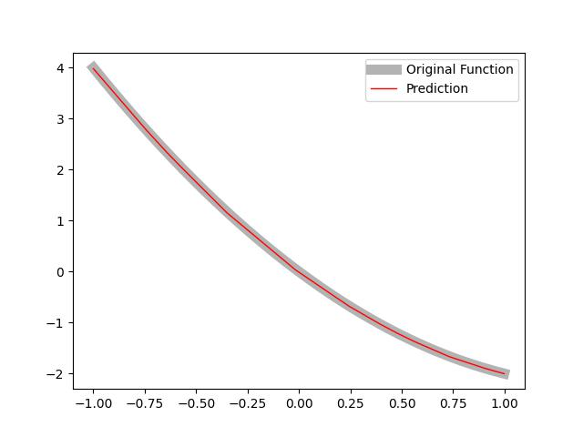

# 实验报告

> - 2253314
> - 拓凯文


## 问题定义

理论和实验证明，一个两层的 ReLU 网络可以模拟任何函数。请自行定义一个函数, 并使用基于 ReLU 的神经网络来拟合此函数


## 理论证明

本问题在数学上讲，令 $f:[0,1]^d\to\mathbb{R}$ 为任意连续函数，给定任意 $\varepsilon>0$。则存在一个单隐层 ReLU 网络

$$
N(x)=\sum_{i=1}^m a_i\,\sigma(w_i^\top x+b_i)+c,
$$

其中 $\sigma(t)=\max\{0,t\}$，使得

$$
\|f-N\|_\infty=\sup_{x\in[0,1]^d}|f(x)-N(x)|<\varepsilon.
$$

对于给定 $\varepsilon>0$，存在一个连续且分段线性的函数 $\phi$，使得

$$
\|f-\phi\|_\infty<\frac{\varepsilon}{2}.
$$

任何定义在有限个单纯形上的连续分段线性函数 $\phi$ 都能被形式如上所示的单隐层 ReLU 网络精确表示。若剖分包含 $K$ 个单纯形，则可构造不超过 $m=K(d+1)$ 个隐藏节点的网络，使

$$
N(x)\equiv\phi(x),\quad\forall x\in[0,1]^d.
$$

令上述 ReLU 网络精确表示的函数为 $N$。则

$$
\|f-N\|_\infty \le \|f-\phi\|_\infty + \|\phi-N\|_\infty < \frac{\varepsilon}{2} + 0 < \varepsilon.
$$

因此，单隐层 ReLU 网络可任意精度地逼近任意连续函数。


## 代码验证

在代码验证阶段，我使用了 Numpy 框架实现了网络与验证的全过程。

### 函数定义

这里用于验证的函数为

$$
f(x) = x^2 - 3 \times x
$$

事实上，任何有界闭集函数均可以被我们的网络拟合。

对于该函数的代码描述为：

```python
def function(x):
    y =  x ** 2 - 3 * x
    return y
```


### 数据采集

为了采集函数上的点用来训练网络，这里使用 NumPy 在区间 $ [-1, 1] $ 上等间距生成 20000 个样本点，并随机划分为训练集（80%）与测试集（20%）

同时，我打乱了最初采集的数据，具体代码如下：

```python
    # 准备数据集
    x = np.linspace(-1, 1, 20000).reshape(-1, 1)
    y = function(x)
    
    # 打乱数据并划分
    idx = np.random.permutation(len(x))
    xs, ys = x[idx], y[idx]
    train_ratio = 0.8
    split = int(len(xs) * train_ratio)
    x_train, y_train = xs[:split], ys[:split]
    x_test,  y_test  = xs[split:], ys[split:]
```

### 模型描述

模型采用两层的 ReLU 网络，一些具体细节如下：
- 隐藏层维度：64
- 初始化方式：Xavier 初始化
- 损失函数：均方误差
- 优化器：固定学习率
- 批大小：32

其中，由于采用了 NumPy 框架，我手动编写了前向传播和反向传播的代码，模型类的具体定义以及函数描述如下：

```python
# 模型定义，使用了 2 层的 ReLU 网络
class Model:
    def __init__(self, config : Config):
        self.W1 = xavier((config.inp_d, config.width))
        self.b1 = np.zeros([1, config.width])
        self.W2 = xavier((config.width, config.out_d))
        self.b2 = np.zeros([1, config.out_d])

    # 激活函数定义
    def ReLU(self, x):
        return np.maximum(0, x)
    
    # 前向传播
    def forward(self, x):
        self.h1 = np.dot(x, self.W1) + self.b1
        self.act = self.ReLU(self.h1)
        return np.dot(self.act, self.W2) + self.b2
    
    # 反向传播
    def backward(self, x, y, label):
        dy = 2 * (y - label) / x.shape[0]
        dW2 = np.dot(self.act.T, dy)
        db2 = np.sum(dy, axis=0, keepdims=True)
        dact = np.dot(dy, self.W2.T)
        dh1 = dact * (self.h1 > 0)
        grad_norm = np.linalg.norm(dh1)
        if grad_norm > 1:
            dh1 /= grad_norm
        dW1 = np.dot(x.T, dh1)
        db1 = np.sum(dh1, axis=0, keepdims=True)
        
        # 更新参数的值
        self.W2 -= lr * dW2
        self.b2 -= lr * db2
        self.b1 -= lr * db1
        self.W1 -= lr * dW1
    
    # 损失函数定义
    def loss(y, label):
        return np.mean((y - label) ** 2)
```

### 拟合效果

根据理论与实验验证，两层的 ReLU 网络可以拟合任何函数，我将原函数与拟合效果进行了绘制，代码如下：

```python
    plt.figure()
    plt.plot(x_plot, y_true, label="Original Function", linewidth=8, color=(0.7, 0.7, 0.7))
    plt.plot(x_plot, y_pred, label="Prediction", linewidth=1, color="red")
    plt.legend(); 
    plt.savefig("fit.jpg")
```

运行结果如下：

